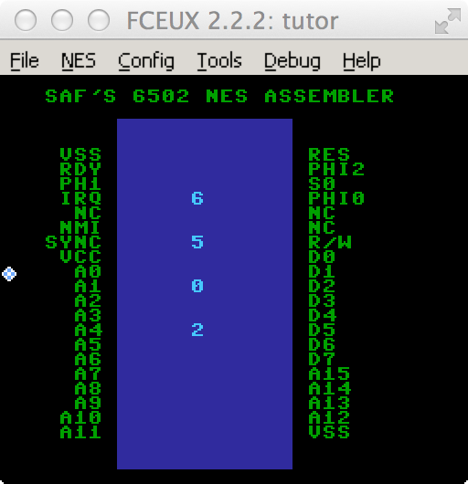

# assembler6502 0.3

An NES assembler for the 6502 microprocessor written in Ruby

 Usage: ./assembler\_6502.rb <infile.asm> -o outfile.nes

  This is a pretty straightfoward assembler, that is currently set up
  to produce iNES ROM formatted binaries from simple assembly listings.
  It is good at knowing which addressing modes are and are not allowed for 
  each instruction, and contains some examples of correct syntax.

  This assembler does not understand banks or mappers yet, and so having
  more than one PROG section does not quite work yet.  That is next
  in line to be fixed.
  
  It handles labels, and does a two pass assembly, first assembling
  the byte codes, and then going back and filling in the proper addresses
  where labels were used.

  I have used this to compile some code for the NES, and it ran correctly
  on FCEUX, got it to make some sounds, load tiles, sprites, and scrolling.

  

  Some Todos:
  - Allow lower case mnemonics in source code
  - Understand how to deal with various mappers
  - Understand how to create multiple banks
  - Get an NSF file playing
  - More unit tests for each instruction
  - I may make this into a Rubygem
  - Maybe I can put some better error messages.
  - I would like to add some Macros to generate settings for
    the PPU and APU, (values for locations like $2000 and $2001,
    the $4000s, etc.)
  - Support binary literals ie %10101010
  - Anonymous Label support, (maybe, not sure if I like the idea)
  - Give this project a better name.

 Some new additions:
  - Ported NES101 tutor to this assembler.
  - Added msb and lsb byte selectors on address labels
  - added .org directive
  - added .dw directive
  - added .bytes directive
  - added .incbin directive
  - added .ascii directive
  - Invented my own iNES header directive that is JSON
  - Split the project up into separate files per class
  - Wrote some more unit tests
  - Added OptionParser for commandline opts
  - Tested a ROM with Sound output
  - Tested a ROM that changes background color

I decided that during the first pass of assembly, I should just initialize
an entire 65535 byte virtual memory images, and write the instructions to
their correct places, and then after resolving symbols during the second pass,
I just clip out the Cartridge ROM area and iNES header at the end, works great 
so far.  Now that I know I will need to support various mappers, I still may 
use this method, but will need to create multiple 65535 memory segments and use
banking to distinguish them before finally writing out the resulting ROM in
the correct order.

